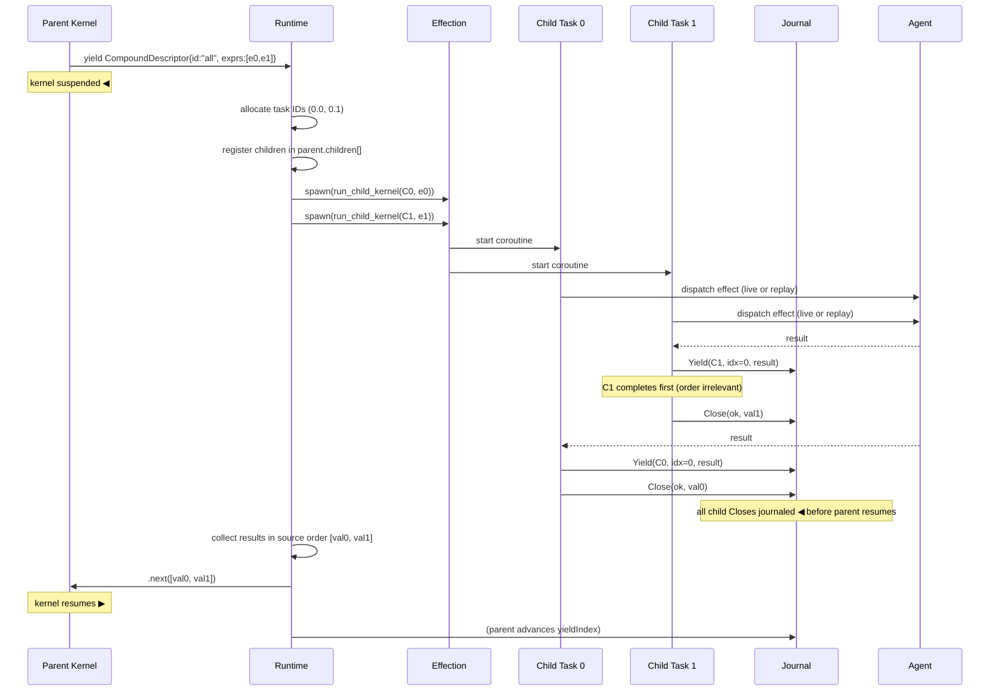
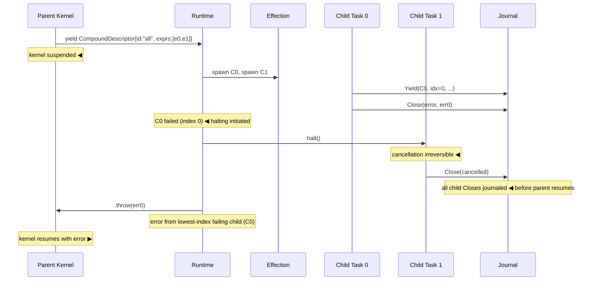
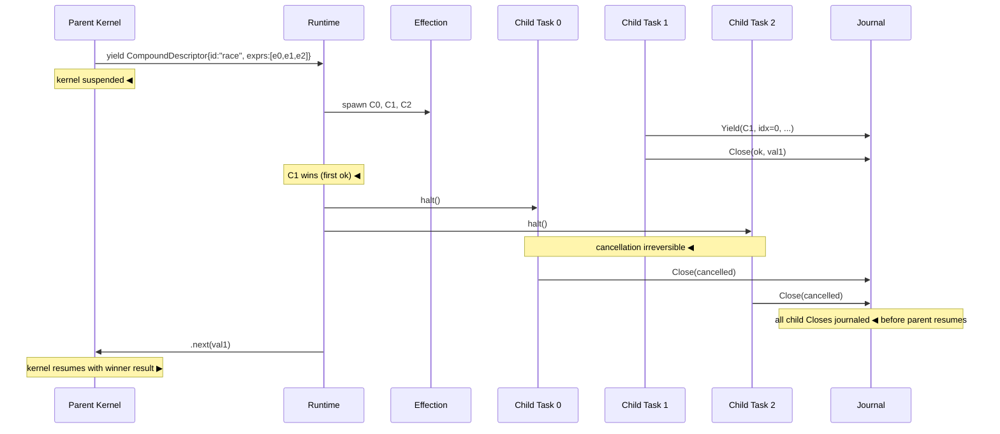
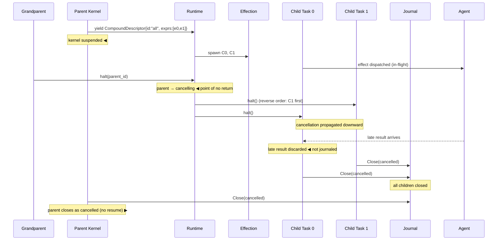
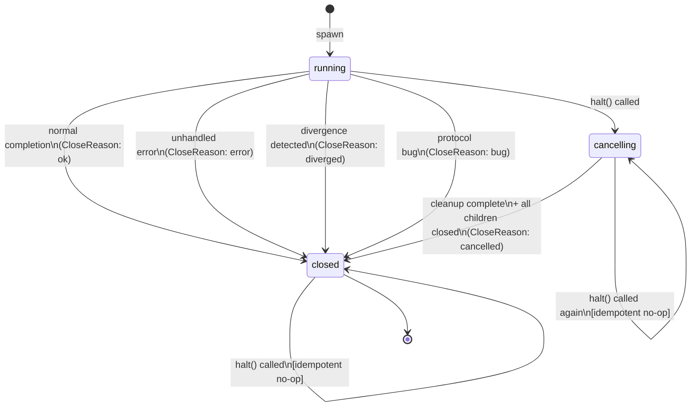

# Tisyn Runtime Specification for Compound Concurrency on Effection

**Applies to:** Tisyn runtime, kernel version ≥ 0.4, Effection ≥ 3.x

---

## Design Summary

This specification defines the runtime and kernel contracts required to support `all` and `race` compound concurrency in Tisyn when Effection is used as the execution substrate.

The central architectural principle is:

> The kernel provides compound suspension semantics for `all` and `race`.  
> The runtime, implemented on top of Effection, provides their concurrency semantics.

The mental model that this specification is written to preserve is:

- The host starts a coroutine.
- That coroutine may suspend on an agent effect.
- The agent response continues that same logical coroutine — it is a resumption point, not a detached job.
- `all` and `race` create structured child work within that same model: they are foreground coroutines whose results are semantically consumed by the parent.
- Cleanup and cancellation obey strict parent/child lifetime rules inherited from Effection's structured concurrency model.
- The result should feel like one logical coroutine with structured children, not a graph of detached futures.

Tisyn tasks are Effection tasks with additional deterministic runtime semantics layered on top. The additional semantics are: deterministic task IDs, replay cursors, journal ordering, typed close reasons, and divergence detection. These belong to the Tisyn runtime and are not owned by Effection.

---

## Table of Contents

1. [Scope and Non-Goals](#1-scope-and-non-goals)
2. [Strict Structured Concurrency and Tisyn](#2-strict-structured-concurrency-and-tisyn)
3. [Architectural Split](#3-architectural-split)
4. [Runtime Task Model](#4-runtime-task-model)
5. [Substrate Integration](#5-substrate-integration)
6. [Kernel Suspend Contract for Compound Effects](#6-kernel-suspend-contract-for-compound-effects)
7. [Runtime Orchestration Semantics](#7-runtime-orchestration-semantics)
8. [Cancellation Model](#8-cancellation-model)
9. [Journal and Event Ordering](#9-journal-and-event-ordering)
10. [Replay Implications](#10-replay-implications)
11. [Failure Model](#11-failure-model)
12. [Normative Invariants](#12-normative-invariants)
13. [Pseudocode Appendix](#13-pseudocode-appendix)
14. [Sequence Diagrams](#14-sequence-diagrams)
15. [Task State Diagram](#15-task-state-diagram)
16. [Implementation Checklist](#16-implementation-checklist)
17. [Changelog from v1.0.0](#17-changelog-from-v100)

---

## 1. Scope and Non-Goals

### 1.1 Scope

This specification covers:

- The kernel-level suspension contract for `all` and `race` compound external effects.
- The runtime task model required to host compound concurrency.
- The mapping of the runtime task model onto Effection's native structured concurrency model.
- Orchestration semantics for `all` and `race` including result collection, failure handling, and sibling cancellation.
- The cancellation model as it applies to compound effects.
- Journal ordering rules for compound concurrency.
- Replay behavior for tasks participating in compound effects.
- The failure taxonomy and its interaction with sibling propagation.

### 1.2 Non-Goals

This specification does not cover:

- **Compiler behavior.** The compiler's responsibility is to emit correct IR, including `external` nodes with ids `"all"` and `"race"` and `data.exprs` arrays. This spec states assumptions about IR shape but does not redefine compiler internals.
- **Agent protocol.** Agents are treated as opaque callees that produce results or errors.
- **Kernel internals for non-compound effects.** Standard `{ id, data }` external yields are not redefined here.
- **Effection internals.** This spec treats Effection as the execution substrate. It does not define or constrain Effection's internal scheduler.
- **Persistence layer.** The spec states what must be journaled and in what order, but does not define storage format.
- **Multi-runtime deployment.** Distribution concerns are out of scope.

### 1.3 Assumptions

This spec assumes:

- The kernel is a generator-based interpreter. Suspension maps to `yield`. Resumption maps to generator `.next(value)` or `.throw(error)`.
- Effection already hosts the evaluator generator lifecycle.
- The journal exists and correctly handles standard external effect writes.
- The base replay algorithm correctly replays standard effects per-coroutine with a `yieldIndex` cursor.
- Compound external effect IR nodes have the shape:

  ```json
  { "type": "external", "id": "all" | "race", "data": { "exprs": [Expr, ...] } }
  ```

---

## 2. Strict Structured Concurrency and Tisyn

### 2.1 The Core Insight

Effection's strict structured concurrency model distinguishes between **foreground** work and **background** work:

- **Foreground** work is work whose result is semantically consumed by the parent. Its value is part of what the parent computes. The parent cannot complete until foreground work completes.
- **Background** work supports foreground computation but its result is not consumed by the parent. Once the foreground is done, background work loses its structural justification and is reclaimed automatically.

The guarantee is: a child **MUST NOT** outlive its parent. When a scope exits, incidental background work is reclaimed automatically. Cleanup still runs. `finally` blocks still run. But the scope does not remain open for work that no longer contributes to its result.

### 2.2 How Tisyn Inherits This Model

Tisyn inherits strict structured concurrency directly from Effection. Every agent interaction is modeled as a **coroutine suspension/resumption point**, not as a detached asynchronous job. An agent invocation is not a future that eventually resolves. It is the point at which the current coroutine suspends and the point at which it continues — one logical thread of execution.

`all` and `race` children are **foreground work** from the parent's perspective:

- Their results are directly consumed by the parent.
- The parent cannot resume until all children reach a terminal state.
- There is no background work in an `all` or `race` context.

The practical consequence is that this specification does not need a separate "background task management" layer, a future-oriented async bridge, or a promise-shaped interface. Effection's native `spawn`/`Operation`/task model is the correct primitive. Tisyn adds deterministic semantics on top of it.

### 2.3 What Tisyn Adds on Top of Effection

Effection provides correct lifetime and cancellation mechanics. Tisyn adds a deterministic overlay:

| Concern                               | Owner         |
| ------------------------------------- | ------------- |
| Lifetime enforcement (child ≤ parent) | Effection     |
| Cooperative cancellation propagation  | Effection     |
| Concurrent child execution            | Effection     |
| Deterministic task IDs                | Tisyn runtime |
| Replay cursors (yieldIndex)           | Tisyn runtime |
| Journal writes and ordering           | Tisyn runtime |
| Typed close reasons                   | Tisyn runtime |
| Divergence detection                  | Tisyn runtime |
| Compound failure selection rules      | Tisyn runtime |
| Source-order result collection        | Tisyn runtime |

The implementation should feel like Effection with a deterministic runtime layer. It should not feel like a separate orchestration engine that happens to use Effection internally.

### 2.4 Agent Effects as Coroutine Suspension

An agent effect is not a fire-and-forget call. From the coroutine's perspective:

1. The coroutine suspends at the `yield` point.
2. The runtime observes the suspended descriptor and dispatches to the agent.
3. When the agent responds, the runtime resumes the same coroutine at the same yield point.

This is the same mental model as `yield*` inside an Effection `Operation`. The coroutine does not become something else while waiting. It remains the same logical execution context, temporarily suspended. Implementers **MUST NOT** model agent effects as detached jobs with callbacks wired back to a coroutine — that is the wrong mental model, and it leads to replay and journal-ordering bugs.

---

## 3. Architectural Split

### 3.1 Kernel Responsibilities

The kernel **MUST**:

- Evaluate `external` IR nodes whose `id` is `"all"` or `"race"` as compound external effects.
- For compound externals, yield unevaluated child expressions (`unquote` semantics).
- Produce a suspension descriptor of the form `{ id: "all" | "race", data: { exprs: Expr[] } }`.
- Resume from suspension with the compound result value as if it were a normal external effect return.
- Remain a sequential, single-threaded interpreter throughout.

The kernel **MUST NOT**:

- Create child tasks.
- Write to the journal.
- Make cancellation decisions.
- Observe or depend on wall-clock time, randomness, or any non-deterministic source.
- Evaluate child expressions before yielding a compound descriptor.

### 3.2 Runtime Responsibilities

The runtime **MUST**:

- Intercept compound suspension descriptors from the kernel.
- Allocate deterministic child task IDs.
- Spawn child coroutines on Effection for each child expression.
- Drive child kernel evaluators with the inherited immutable environment.
- Collect child results and compose the compound result per `all` or `race` semantics.
- Resume the parent kernel with the composed result.
- Enforce journal ordering: child `Close` events precede parent resumption.
- Perform all journal writes on behalf of the task lifecycle.
- Manage replay cursors per task.
- Halt siblings per the compound semantics.
- Enforce structured concurrency: no child outlives its parent.
- Enforce reverse child teardown order regardless of substrate behavior.

The runtime **MUST NOT**:

- Rely on Effection's internal task identity as the canonical Tisyn task identity.
- Allow Effection to define journal write ordering.
- Delegate journal write authority to agents or to Effection callbacks.

### 3.3 Substrate (Effection) Responsibilities

The runtime relies on Effection for:

- Structured lifetime management: a child operation's lifetime is bounded by its parent scope.
- Cooperative cancellation propagation: cancelling a scope cascades to child operations.
- Concurrent execution of child operations within a parent scope.
- Running cleanup (`finally`-equivalent) paths when a scope is torn down.

The runtime **MUST NOT** assume that Effection:

- Assigns Tisyn-compatible task IDs.
- Produces journal writes.
- Determines replay cursor positions.
- Selects compound failure values according to Tisyn's deterministic rules.
- Tears down children in any particular order.

For any property that the runtime cannot guarantee Effection provides, the runtime **MUST** enforce that property itself.

### 3.4 Agent Responsibilities

Agents **MUST**:

- Accept a typed request payload.
- Produce a typed result or error.
- Return results via the runtime's effect dispatch mechanism.

Agents **MUST NOT**:

- Write to the journal.
- Know their task ID.
- Know whether they are executing live or under replay.
- Spawn sibling or child tasks.

---

## 4. Runtime Task Model

### 4.1 Task Record

```
TaskRecord {
  id:           TaskId           // globally unique, deterministic string
  parentId:     TaskId | null    // null for root task
  children:     TaskId[]         // ordered list of child IDs in spawn order
  state:        TaskState        // see §4.3
  yieldIndex:   uint             // monotonically increasing per-task yield counter
  closeReason:  CloseReason | null
}

TaskState    = "running" | "cancelling" | "closed"

CloseReason =
  | { tag: "ok",        value: Val }
  | { tag: "error",     error: AppError }
  | { tag: "cancelled"               }
  | { tag: "diverged",  detail: string }
  | { tag: "bug",       detail: string }
```

Note: `pendingEffect` is tracked inside the Effection-hosted coroutine's execution context, not as a field on the task record. It is the coroutine's current suspension point. The task record captures only what is needed for journal ordering, replay, and close sequencing.

### 4.2 Deterministic Child ID Allocation

Child IDs **MUST** be derived deterministically from the parent ID and the child's spawn-order index within the parent.

```
child_id(parent_id, spawn_index) = parent_id + "." + spawn_index
```

Root task: `id = "0"`.

A root task spawning an `all` with two children: `"0.0"` and `"0.1"`.

A child `"0.0"` that itself spawns a `race` with two children: `"0.0.0"` and `"0.0.1"`.

The `spawn_index` is the child's position in the `exprs` array of the originating compound effect, zero-based.

**Invariant I-ID:** Given the same IR and journal, task IDs MUST be identical across runs.

Additionally, the unified `childSpawnCount` allocator is advanced by inline invocation. Each accepted `invokeInline(fn, args, opts?)` call from a valid dispatch-boundary call site (per `tisyn-inline-invocation-specification.md` §6.2) MUST advance the parent's `childSpawnCount` by exactly `+1`. The allocated coroutineId uses the standard `parentId.{k}` format and names an **inline lane** — a durable replay identity for journaling the inline body's effects. Unlike coroutineIds allocated by `invoke`, `spawn`, `resource`, `scope`, `timebox`, `all`, or `race`, the inline lane's coroutineId does not create a new Effection scope boundary and does not produce a `CloseEvent`. A rejected `invokeInline` call (invalid call site, invalid input) MUST NOT advance the allocator. Invariant I-ID applies uniformly: for the same IR, inputs, and middleware code, inline lane IDs allocated by `invokeInline` MUST be byte-identical across original run and replay, interleaved deterministically with IDs allocated by all other allocation origins.

This amendment does not change the unified allocator's mechanics, counter format, or I-ID invariant. It adds `invokeInline` as a new allocation origin alongside the existing set, and documents that the allocated ID is an inline lane — not a child scope.

### 4.3 Task State Machine

```
         spawn
           │
           ▼
        running ─────────────── normal/error complete ──────────► closed
           │                                                          ▲
           │ halt()                                                   │
           ▼                                                          │
       cancelling ──────── cleanup complete + all children closed ───┘
           │
           │ halt() (while already cancelling)
           ▼
       [no-op: idempotent]
```

State transitions:

| From         | Event                               | To           | CloseReason |
| ------------ | ----------------------------------- | ------------ | ----------- |
| `running`    | kernel completes normally           | `closed`     | `ok`        |
| `running`    | kernel propagates unhandled error   | `closed`     | `error`     |
| `running`    | `halt()` called                     | `cancelling` | —           |
| `cancelling` | cleanup runs; all children `closed` | `closed`     | `cancelled` |
| `running`    | divergence detected                 | `closed`     | `diverged`  |
| `running`    | protocol/runtime bug detected       | `closed`     | `bug`       |
| `cancelling` | `halt()` called again               | `cancelling` | no-op       |
| `closed`     | `halt()` called                     | `closed`     | no-op       |

**`halt()` is idempotent.** Calling `halt()` on a task already in `cancelling` or `closed` state MUST have no effect. This is true even when cleanup/finally logic is currently running.

A task **MUST NOT** be considered `closed` until all of its children are `closed`.

### 4.4 Parent/Child Registration

When the runtime spawns a child task:

1. It **MUST** allocate a `TaskRecord` with `parentId` set to the parent's `id`.
2. It **MUST** append the child's `id` to the parent's `children` array, in spawn order (matching `exprs` index order), before the child begins execution.

### 4.5 Blocked-on-Children Semantics

A parent is **blocked on children** when it has dispatched a compound effect and is waiting for all children to reach `closed`. During this period:

- The parent kernel is suspended at the compound `yield` point.
- The parent's `yieldIndex` does **not** advance.
- The parent **MUST NOT** journal any yield event.
- The parent **MUST NOT** be resumed until all children are in the `closed` state.

---

## 5. Substrate Integration

### 5.1 Model: Tisyn Tasks as Effection Tasks

Each Tisyn runtime task **MUST** be hosted by exactly one Effection task. The Effection task's structured lifetime is the execution boundary for the Tisyn task. Tisyn's deterministic semantics are layered on top.

The mapping is:

| Tisyn concept       | Effection equivalent              |
| ------------------- | --------------------------------- |
| Task spawn          | `spawn(operation)` inside scope   |
| Task cancellation   | Effection scope cancellation      |
| Blocked-on-children | `yield*` on structured children   |
| Structured lifetime | Effection parent/child scoping    |
| Cleanup (finally)   | `finally {}` / Effection `ensure` |
| Concurrent children | Multiple `spawn()` within scope   |

### 5.2 RuntimeTaskHost

The runtime exposes a `RuntimeTaskHost` interface. This is a **Tisyn runtime abstraction**, not a generic Effection adapter. It accepts Tisyn types and encapsulates the child lifecycle inside an Effection scope. Its methods use Effection-native operation semantics internally.

```typescript
interface RuntimeTaskHost {
  // Spawn a child Tisyn task within the current Effection scope.
  // The child evaluates `expr` with `env` inside a new Effection task.
  // The child TaskRecord must be pre-registered before calling this.
  spawnChild(child: TaskRecord, expr: Expr, env: Env): ChildTask;

  // Initiate halting of a task: transitions it to `cancelling` and propagates
  // downward. Idempotent: safe to call on cancelling or closed tasks.
  // halt() does NOT synchronously drain the task to closed. Terminal completion
  // is observed via ChildTask.join within the caller's structured scope.
  halt(taskId: TaskId): void;
}

// ChildTask is not a Promise. It is a handle to an Effection-hosted
// structured child. The parent observes it by joining inside its own scope.
interface ChildTask {
  taskId: TaskId;
  // An Effection Operation that resolves when the child reaches `closed`.
  // The parent yield*s this operation within its own Effection scope.
  join: Operation<CloseReason>;
}
```

`ChildTask.join` is an Effection `Operation`, not a Promise. The parent runtime `yield*`s it from within its own Effection scope. This preserves the structured lifetime guarantee: the join operation is child work observed from within the parent's structured scope.

**What RuntimeTaskHost does NOT own:**

- `all` semantics (source-order results, sibling halt on failure).
- `race` semantics (first-success selection, deterministic failure selection).
- Journal writes.
- Replay cursor management.

These belong to the Tisyn runtime logic described in §7 and §13.

### 5.3 Reverse Teardown Order

The normative requirement is a **close-order guarantee**: when the runtime tears down multiple siblings, every child MUST reach `closed` in reverse spawn order. That is, `children[N-1]` MUST be `closed` before `children[N-2]` is `closed`, and so on down to `children[0]`.

The runtime **MUST** guarantee this close-order property independently of Effection's internal behavior.

One mechanism that satisfies it is: issue `halt()` to each sibling in reverse index order and `yield*`-join each to `closed` before proceeding to the previous sibling. This serial halt-and-drain approach trivially produces the required close ordering. Implementations MAY use other mechanisms provided the close-order invariant holds.

The ordering guarantee is a Tisyn runtime responsibility. It is not delegated to Effection.

---

## 6. Kernel Suspend Contract for Compound Effects

### 6.1 Compound vs. Standard Externals

The kernel evaluates `external` IR nodes. The compound external ID set is `{ "all", "race" }`. For compound IDs, the kernel uses `unquote` semantics. For all other IDs, the kernel uses `resolve` semantics (evaluate the argument to a value before yielding).

### 6.2 Kernel Yield Shape

Compound suspension descriptor:

```
CompoundDescriptor = {
  id:   "all" | "race",
  data: { exprs: Expr[] }   // raw IR, NOT evaluated values
}
```

Standard suspension descriptor:

```
StandardDescriptor = {
  id:   string,   // not "all" or "race"
  data: Val       // evaluated argument
}
```

### 6.3 Pseudocode for `eval_external`

```
function eval_external(node: ExternalNode, env: Env) -> SuspendDescriptor:
  if node.id in { "all", "race" }:
    // unquote path: child expressions cross the boundary unevaluated
    return { id: node.id, data: { exprs: node.data.exprs } }
  else:
    // resolve path: evaluate argument before suspending
    arg_val = eval(node.data, env)
    return { id: node.id, data: arg_val }
```

### 6.4 Kernel Resumption

After the runtime orchestrates compound concurrency and produces a result:

- `all` success: runtime calls `.next(Val[])` — results in source-expression order.
- `race` success: runtime calls `.next(Val)` — the winning child's result.
- Failure: runtime calls `.throw(AppError)`.

The kernel handles both resumption paths identically to standard external resumption.

### 6.5 Kernel Non-Responsibility Statement

Any implementation that places task spawning, cancellation decisions, journal writes, or compound result selection logic inside the kernel is **non-conforming**.

---

## 7. Runtime Orchestration Semantics

### 7.1 Common Preamble

When the runtime intercepts a compound descriptor from the kernel:

1. Record the parent's current `yieldIndex` (the compound effect occupies this index).
2. Allocate child task records with IDs `child_id(parent_id, i)` for `i` in `[0, exprs.length)`.
3. Register all children in the parent's `children` array, in index order, before any child begins.
4. Each child **MUST** inherit the parent's immutable environment `env` exactly.

### 7.2 `all` Semantics

#### 7.2.1 Empty List

If `exprs` is empty, the runtime **MUST** immediately resume the parent kernel with `[]`. No child tasks are created.

#### 7.2.2 Spawn and Execute

Spawn N child tasks concurrently. Each child evaluates `exprs[i]` starting from `yieldIndex = 0`. The parent remains blocked on children until all reach `closed`.

#### 7.2.3 Success Path

If all N children close with `CloseReason: ok`:

1. Collect results in source-expression order by child index. Completion order does not affect result order.
2. Journal all child close events before resuming the parent (see §9).
3. Resume the parent kernel with `Val[]`.

#### 7.2.4 Failure Path

If any child closes with `CloseReason: error`:

1. Halt all remaining running siblings. `halt()` is idempotent.
2. Wait for all running/cancelling siblings to reach `closed`.
3. Resume the parent via `.throw(error)` where `error` is selected by the deterministic rule: **the error from the lowest-index failing child** in the `exprs` array.

The failure selection rule is **source-order based**. It is scheduler-independent. No timing-dependent language ("first to arrive", "last received") applies.

#### 7.2.5 Result Order Invariant

Result order **MUST** be source-expression order. An implementation that returns results in completion order is **non-conforming**.

### 7.3 `race` Semantics

#### 7.3.1 Empty List

`race([])` is a protocol/runtime bug. If `exprs` is empty, the runtime **MUST** close the parent task with `CloseReason: bug` (detail: `"race([]) called with empty expression list"`). It **MUST NOT** be modeled as a never-resolving suspension and **MUST NOT** surface as an application-level error catchable by IR error-handling constructs.

#### 7.3.2 Single Child

If `exprs.length == 1`, the runtime MAY treat it as a single child evaluation. Full task record and journal semantics apply.

#### 7.3.3 Normal Case (N > 1)

1. Spawn N child tasks concurrently.
2. Observe child terminal states as they arrive.
3. The **winner** is the first child to close with `CloseReason: ok`.
4. On first winner:
   a. Record the winner's result.
   b. Halt all remaining running siblings.
   c. Wait for all siblings to reach `closed`.
   d. Resume the parent kernel with the winner's `Val`.

#### 7.3.4 Failure Handling

A child closing with `CloseReason: error` does **not** win. The runtime:

1. **MUST NOT** resume the parent for a failed child.
2. **MUST** continue observing remaining children.
3. If all N children close with `CloseReason: error`, resume the parent via `.throw(error)` where `error` is selected by the deterministic rule: **the error from the lowest-index failing child** in the `exprs` array.

The failure selection rule for `race` is identical to `all`: lowest-index failing child. This is scheduler-independent.

#### 7.3.5 Terminal-Outcome Classification

In normal `race` execution — absent a protocol/runtime bug, divergence, or an external `halt()` on the parent — every child closes with one of `ok`, `error`, or `cancelled`. The exhaustive normal terminal outcomes are:

- **At least one child closes `ok`:** the first such child in arrival order is the winner; remaining children close as `cancelled` (having been halted). Parent resumes with the winner's value.
- **All children close `error`:** no winner; parent resumes with the lowest-index error.

A `cancelled` child close is never a primary outcome in normal execution — it is always a consequence of either a winner being determined or a parent halt propagating downward.

Any state where the drain loop completes with no winner recorded **and** `errors_by_idx` is empty cannot arise in normal execution. An implementation that reaches this state **MUST** treat it as a protocol/runtime bug (`CloseReason: bug`), not as a vague catch-all or a silently undefined result. See §13.7 for the corresponding pseudocode assertion.

---

## 8. Cancellation Model

### 8.1 State Transitions

```
function halt(task_id: TaskId): void:
  task = get_task(task_id)

  // Idempotent: no-op if already cancelling or closed
  if task.state != "running":
    return

  task.state = "cancelling"

  // Propagate downward in reverse spawn order
  for child_id in reversed(task.children):
    halt(child_id)   // recursive; idempotent at each level

  // Signal the hosting Effection scope
  signal_effection_halt(task)
```

### 8.2 Point of No Return

Once a task enters `cancelling`:

- It **MUST NOT** return to `running`.
- Agent results arriving after this transition are **late results** and **MUST** be discarded.
- Late results **MUST NOT** be journaled.
- The kernel **MUST NOT** be resumed with agent data.
- Cleanup/finally effects MAY still run (they are part of the same coroutine, not new work).

### 8.3 Downward Propagation

Cancellation **MUST** propagate to all descendants, not only direct children. `halt()` is recursive and idempotent at every level.

### 8.4 Reverse Child Teardown Order

When multiple children must be torn down, the runtime **MUST** tear them down in reverse spawn order: `children[N-1]` before `children[N-2]`, down to `children[0]`.

This is a Tisyn runtime guarantee. If the hosting Effection substrate does not provide LIFO teardown with respect to Tisyn spawn order, the runtime MUST impose it explicitly.

### 8.5 Late-Result Discard

```
if task.state == "cancelling" or task.state == "closed":
  // discard agent response
  // do NOT advance yieldIndex
  // do NOT journal
  return
```

### 8.6 Cancellation While Blocked on Children

If the parent is blocked on compound children when it receives a `halt()` call:

1. The parent transitions to `cancelling`.
2. All running children are halted (downward, reverse order).
3. The runtime drains all children to `closed`.
4. The parent closes with `CloseReason: cancelled`.
5. The runtime **MUST NOT** resume the parent kernel's main flow.
6. Cleanup/finally effects on the parent MAY still run.

### 8.7 Cleanup/Finally Effects

Cleanup effects that run after cancellation:

- Use the **same `yieldIndex` sequence** as the task's main flow. No reset.
- Are journaled normally.
- Are subject to late-result discard if they themselves invoke agent effects and the task is already `cancelling`.

### 8.8 Nested Halt (Idempotent)

If `halt()` is called on a task already in `cancelling` state — including while cleanup/finally logic is running — the call has no effect. The state remains `cancelling`. No further propagation is initiated.

---

## 9. Journal and Event Ordering

### 9.1 Per-Task Yield Order

Within a single task, journal events **MUST** be written in `yieldIndex` order. The counter:

- Starts at 0 when the task is spawned.
- Increments by 1 each time the kernel yields and a result is received.
- Never resets.
- Continues through cleanup/finally effects.

### 9.2 Child Close Before Parent Consumption

The runtime **MUST** ensure all children's `Close` events are journaled before:

- The parent's `yieldIndex` advances past the compound suspension point.
- The parent journals its next yield.
- The parent's own `Close` event is journaled.

This is a hard causal requirement.

### 9.3 Parent Close After All Children Close

A parent's `Close` event **MUST NOT** be journaled until all descendants have journaled `Close`. This applies recursively.

### 9.4 `Close(cancelled)` Events

A task closing with `CloseReason: cancelled` **MUST** journal a `Close(cancelled)` event after all cleanup effects have run and before the parent's next journal event.

### 9.5 Causal Ordering Summary

```
[parent: Yield(compound_descriptor, yieldIndex=K)]
  ── children execute concurrently ──
  [child_i: Yield(effect, yieldIndex=0)]
  [child_i: ... yields ...]
  [child_i: Close(ok | error | cancelled)]   // for all i in [0, N-1]
[parent: Yield(next, yieldIndex=K+1)]        // only after all children closed
```

Children may interleave with one another freely. The constraint is only:

1. All child `Close` events precede any new parent journal event.
2. Within each child, events are in `yieldIndex` order.

### 9.6 Journal Ordering Is a Lifecycle Consequence

Journal ordering is not enforced by a separate mechanism. It is the natural consequence of:

- Tasks cannot close before their children close.
- Parents cannot resume before their children are closed.
- `yieldIndex` is monotonic.

An implementation that correctly enforces lifecycle rules will produce conforming journal order without additional enforcement.

---

## 10. Replay Implications

### 10.1 Per-Task Replay Cursors

Each task has an independent replay cursor:

```
ReplayCursor {
  taskId:     TaskId
  yieldIndex: uint   // next expected yieldIndex in the journal
}
```

The runtime queries the journal for `(taskId, yieldIndex)`. If found, it replays without contacting the agent. When no entry exists for the next `yieldIndex`, the task transitions to live execution.

### 10.2 Determinism Under Replay

Because child task IDs are derived deterministically from parent ID and spawn index, replay **MUST** produce the same task IDs as the original run. The runtime **MUST NOT** use randomness or wall-clock time in ID allocation.

### 10.3 Replaying Compound Effects

When the parent's replay cursor reaches a compound effect yield entry:

1. Children are spawned with deterministic IDs derived from the parent.
2. Each child begins replay from `yieldIndex = 0` using its own cursor.
3. A child with a complete journal (including `Close`) replays to completion without agent dispatch.
4. A child with a partial journal replays available entries, then transitions to live.
5. A child with no journal entries begins live execution immediately.

Children still execute inside Effection-structured scopes. Replay does not flatten child structure.

### 10.4 Divergence Conditions

Divergence occurs when the IR's execution would produce a journal event that does not match the recorded entry at `(taskId, yieldIndex)`. The runtime **MUST** close the affected task with `CloseReason: diverged` and propagate fatally.

Divergence conditions include:

- `exprs.length` mismatch at a compound suspension point.
- Compound effect ID mismatch (`all` recorded but IR now has `race`).
- Result type mismatch (expected `ok`, got `error`).
- Child task ID mismatch due to IR structural change.

### 10.5 Replay-to-Live Transition

Transition from replay to live is seamless. The kernel is unaware of which mode it is in. When the next `yieldIndex` has no journal entry, the runtime dispatches live and journals the result.

### 10.6 Host Crash and Restart Recovery

Host crash recovery is a first-class runtime operation. The replay mechanism defined in §10.1–10.5 is the sole authoritative source of recovery state. No transport session, in-memory host state, or browser tab continuity is required or consulted.

#### 10.6.1 Recovery Source of Truth

The runtime **MUST** reconstruct execution after a host crash solely from:

1. The durable journal (per-task `(taskId, yieldIndex, outcome)` entries).
2. The original expression tree (IR).

No other state is required. A host restart, browser tab reconnect, or new process launch **MUST** be able to resume execution by replaying the journal against the IR from the beginning of each affected task tree.

Reconnecting a browser tab or UI session is **observational reattachment** — it restores the ability to observe and interact with a running or recovering workflow. It is **not** a semantic continuation event by itself. Semantic continuation is driven exclusively by journal replay followed by live execution from the first missing yield.

#### 10.6.2 Durable Yield Rule

The boundary between "must replay" and "may re-dispatch" is determined by whether a `Yield` entry for the relevant `(taskId, yieldIndex)` exists in the durable journal:

- An effect with a **durable recorded Yield** MUST NOT be re-dispatched to an agent on recovery. The runtime MUST replay the journaled outcome.
- An effect with **no durable recorded Yield** — meaning the host crashed after dispatching to the agent but before journaling the result — MUST be treated as in-flight and is eligible for re-dispatch on recovery. The runtime SHOULD re-dispatch such effects as if they are being executed for the first time from the agent's perspective.

This rule applies uniformly to:

- Standard external effects.
- Child task effects created by compound operations (`all`, `race`), using each child's own `(taskId, yieldIndex)` replay cursor.

#### 10.6.3 Partial-Journal Task Recovery

When recovery begins for a task tree that was interrupted mid-execution:

- Tasks with a `Close` entry in the journal are fully complete. Their `CloseReason` is replayed directly; no re-execution occurs.
- Tasks with partial journal entries (some `Yield` events but no `Close`) resume replay from their next missing `yieldIndex` and transition to live when the journal is exhausted.
- Tasks with no journal entries begin live execution immediately.

The replay chapter (§10.1–10.5) defines the exact mechanism. This subsection names crash/restart as a trigger for that mechanism and constrains how the runtime MUST behave with respect to session continuity and re-dispatch eligibility.

#### 10.6.4 At-Least-Once Re-Dispatch and Idempotency

Because an in-flight effect may have been delivered to an agent before the host crashed, re-dispatch on recovery may result in an agent receiving the same logical request more than once. The runtime MUST re-dispatch such effects. Whether the agent is idempotent is outside the scope of this specification, but implementations SHOULD document the at-least-once delivery guarantee so that agent authors can design accordingly.

---

## 11. Failure Model

### 11.1 Failure Categories

| Category             | Definition                                 | Journaled?        | Effect on siblings in `all`            | Effect on siblings in `race`     |
| -------------------- | ------------------------------------------ | ----------------- | -------------------------------------- | -------------------------------- |
| Application Error    | Agent returned error, or IR raised error.  | Yes (`error`)     | Halt running siblings, propagate error | No win; check remaining children |
| Cancellation         | `halt()` called. Not an application error. | Yes (`cancelled`) | N/A — initiated by sibling error       | N/A                              |
| Protocol/Runtime Bug | Runtime invariant violated.                | Yes (`bug`)       | Halt siblings, fatal propagation       | Halt siblings, fatal propagation |
| Divergence           | Replay mismatch detected.                  | Yes (`diverged`)  | Halt siblings, fatal propagation       | Halt siblings, fatal propagation |

### 11.2 Application Errors

Application errors are normal program-level failures. They:

- Are journaled with the error value.
- Trigger sibling cancellation in `all` (§7.2.4).
- Are not winning events in `race` (§7.3.4).
- Are catchable by parent IR error-handling constructs.

### 11.3 Cancellation Is Not an Error

Cancellation **MUST NOT** be treated as an application error. A cancelled child does not propagate an error to the parent. Its `Close(cancelled)` event is journaled, but it does not trigger the failure path in `all` or `race` (the failure/cancellation was already in progress when siblings were cancelled).

### 11.4 Deterministic Error Selection

When multiple children fail (in `all`) or all children fail (in `race`), the runtime **MUST** propagate the application error from the **lowest-index failing child** in the `exprs` array.

This rule is:

- Source-order based, not timing-based.
- Deterministic under any scheduler.
- Stable across replay runs.

### 11.5 Protocol/Runtime Bugs and Divergence

Protocol bugs and divergence are not catchable at the application level. They **MUST** propagate to the root if not handled by a human operator (e.g., crash with diagnostic information).

---

## 12. Normative Invariants

| #    | Invariant                                                                                                                                   |
| ---- | ------------------------------------------------------------------------------------------------------------------------------------------- |
| I-1  | No child task outlives its parent. When a parent closes, all children MUST already be closed.                                               |
| I-2  | A parent's `Close` event is journaled only after all of its children's `Close` events are journaled.                                        |
| I-3  | A task's `yieldIndex` is strictly monotonically increasing. It never resets.                                                                |
| I-4  | Once a task enters `cancelling`, no journal event is written from an agent result (late results are discarded).                             |
| I-5  | The result order of `all` is the source order of `exprs`. Completion order does not affect result order.                                    |
| I-6  | The winner of `race` is the first child to close with `CloseReason: ok`. A failed child never wins.                                         |
| I-7  | The kernel never creates child tasks, never halts tasks, and never writes to the journal.                                                   |
| I-8  | Child task IDs are deterministic: given the same IR and journal, the same task IDs are produced.                                            |
| I-9  | Each task has an independent replay cursor. Advancing one task's cursor does not affect another's.                                          |
| I-10 | Cancelled tasks emit `Close(cancelled)` to the journal. This is the terminal event for the task.                                            |
| I-11 | The parent's `yieldIndex` does not advance while the parent is blocked on children.                                                         |
| I-12 | Cleanup/finally effect yields continue the same `yieldIndex` sequence as the main task flow.                                                |
| I-13 | `race([])` is a protocol/runtime bug (`CloseReason: bug`). It is not a never-resolving suspension and is not a catchable application error. |
| I-14 | Children in `all` and `race` inherit the parent's environment immutably.                                                                    |
| I-15 | `halt()` is idempotent. Calling it on a `cancelling` or `closed` task has no effect.                                                        |
| I-16 | Children are torn down in reverse spawn order. This is a Tisyn runtime guarantee, independent of substrate behavior.                        |
| I-17 | When multiple children fail, the propagated error is from the lowest-index failing child.                                                   |
| I-18 | Agent effects are coroutine suspension/resumption points. They are not detached jobs.                                                       |

---

## 13. Pseudocode Appendix

The pseudocode uses generator-style notation (`yield*`) consistent with Effection's Operation model. Child coroutines are spawned with `spawn()` and joined with `yield*`. This reflects the strict structured concurrency model: child work is foreground work, joined directly by the parent.

### 13.1 Task Creation

```
function create_task(parent_id: TaskId | null, spawn_index: uint): TaskRecord:
  id = if parent_id is null then "0" else parent_id + "." + spawn_index

  task = TaskRecord {
    id:          id,
    parentId:    parent_id,
    children:    [],
    state:       "running",
    yieldIndex:  0,
    closeReason: null,
  }
  register_task(task)

  if parent_id is not null:
    parent = get_task(parent_id)
    assert parent.children.length == spawn_index
    parent.children.push(id)

  return task
```

### 13.2 Running a Child Kernel

```
// An Effection Operation that runs a child kernel coroutine to completion.
// Used by spawnChild; hosted inside an Effection structured scope.
function* run_child_kernel(child: TaskRecord, expr: Expr, env: Env):
  kernel_gen = make_kernel_generator(expr, env)

  try:
    result = yield* drive_kernel(child, kernel_gen)
    yield* complete_task(child, CloseReason.ok(result))
  catch AppError as e:
    yield* complete_task(child, CloseReason.error(e))
  // CancellationSignal is handled inside drive_kernel via the substrate
```

### 13.3 Driving the Kernel (Effect Dispatch with Replay)

```
// Drives a kernel generator to completion, dispatching effects as needed.
// Returns the kernel's final return value.
function* drive_kernel(task: TaskRecord, gen: Generator): Val:
  result = gen.next()   // start the generator

  while not result.done:
    descriptor = result.value  // SuspendDescriptor from kernel yield

    if descriptor.id in { "all", "race" }:
      // Compound effect: runtime orchestrates children
      compound_result = yield* dispatch_compound(task, descriptor)
      result = gen.next(compound_result)
    else:
      // Standard effect: dispatch to agent (with replay)
      effect_result = yield* dispatch_effect(task, descriptor)
      result = gen.next(effect_result)

  return result.value
```

### 13.4 Standard Effect Dispatch with Replay

```
function* dispatch_effect(task: TaskRecord, desc: StandardDescriptor): Val:
  yield_idx = task.yieldIndex
  task.yieldIndex += 1

  // Replay path
  replayed = journal_lookup(task.id, yield_idx)
  if replayed is not null:
    if replayed.outcome.tag == "ok":   return replayed.outcome.value
    else:                              throw replayed.outcome.error

  // Live path: suspend coroutine, dispatch to agent
  // The substrate suspends this coroutine here.
  agent_response = yield* invoke_agent(desc)

  // Check for cancellation after resumption
  if task.state != "running":
    // Late result: discard, do not journal
    yield* effection_halt()   // unwind via substrate cancellation

  // Journal before resuming the kernel
  journal_write(task.id, TaskEvent.Yield(yield_idx, desc.id, agent_response))

  return agent_response
```

### 13.5 Compound Effect Dispatch

```
function* dispatch_compound(parent: TaskRecord, desc: CompoundDescriptor): Val:
  if desc.id == "all":
    return yield* orchestrate_all(parent, desc.data.exprs, parent.env)
  else if desc.id == "race":
    return yield* orchestrate_race(parent, desc.data.exprs, parent.env)
```

### 13.6 `orchestrate_all`

```
function* orchestrate_all(parent: TaskRecord, exprs: Expr[], env: Env): Val[]:
  if exprs.length == 0:
    return []

  N = exprs.length

  // Allocate and register all child task records before any child runs.
  children = []
  for i in [0, N):
    child = create_task(parent.id, i)
    children.push(child)

  // Spawn all children as structured Effection tasks within this scope.
  child_tasks = []
  for i in [0, N):
    ct = spawn(run_child_kernel(children[i], exprs[i], env))
    child_tasks.push(ct)

  // Observe child completions in arrival order.
  // CompletionChannel collects (index, CloseReason) pairs as each child closes,
  // regardless of spawn order. Each child posts to the channel from within its
  // own structured scope when it reaches `closed`.
  completions  = new CompletionChannel(child_tasks)
  results      = new Array(N)      // indexed by spawn order, filled as children close
  errors_by_idx = new Map()        // index → AppError, for deterministic selection
  closed_count = 0

  while closed_count < N:
    (idx, reason) = yield* completions.next()
    closed_count += 1

    if reason.tag == "ok":
      results[idx] = reason.value

    else if reason.tag == "error":
      errors_by_idx.set(idx, reason.error)
      if errors_by_idx.size == 1:
        // First observed error: immediately halt all remaining running siblings.
        // halt() is idempotent; already-closing siblings are unaffected.
        for j in [0, N):
          if children[j].state == "running":
            halt(children[j].id)

    // "cancelled" close reasons require no action: these are siblings that were
    // halted as a consequence of a prior error. They are drained by the loop.

  // All children are now closed. Journal ordering is enforced by complete_task().

  if not errors_by_idx.isEmpty():
    // Propagate the error from the lowest-index failing child.
    // This is source-order based, not arrival-order based.
    failing_idx = min(errors_by_idx.keys())
    throw errors_by_idx.get(failing_idx)

  return results   // in source-expression (spawn) order
```

### 13.7 `orchestrate_race`

```
function* orchestrate_race(parent: TaskRecord, exprs: Expr[], env: Env): Val:
  if exprs.length == 0:
    // Protocol/runtime bug: race([]) is never valid (see §7.3.1).
    close_as_bug(parent, "race([]) called with empty expression list")
    return  // unreachable; close_as_bug unwinds the coroutine

  N = exprs.length

  // Allocate and register all child task records before any child runs.
  children = []
  for i in [0, N):
    child = create_task(parent.id, i)
    children.push(child)

  // Spawn all children as structured Effection tasks within this scope.
  child_tasks = []
  for i in [0, N):
    ct = spawn(run_child_kernel(children[i], exprs[i], env))
    child_tasks.push(ct)

  // Observe child completions in arrival order.
  // CompletionChannel is an illustrative abstraction — see note below §13.7.
  // It yields (index, CloseReason) in the order completions actually occur,
  // not source order. This is what makes race semantics correct: any child
  // can win based on when it actually finishes, regardless of its position
  // in exprs.
  completions   = new CompletionChannel(child_tasks)
  winner        = null        // { index, value } of first ok child
  errors_by_idx = new Map()   // index → AppError for deterministic selection
  closed_count  = 0

  while closed_count < N:
    (idx, reason) = yield* completions.next()
    closed_count += 1

    if reason.tag == "ok" and winner is null:
      // First successful child: this is the winner.
      winner = { index: idx, value: reason.value }
      // Halt all remaining running siblings.
      // halt() is idempotent; already-closing siblings are unaffected.
      for j in [0, N):
        if children[j].state == "running":
          halt(children[j].id)

    else if reason.tag == "error":
      errors_by_idx.set(idx, reason.error)

    // "cancelled" close reasons require no action: these are losers halted
    // after the winner was determined (or after the all-fail path began).
    // They are drained by the loop.

  // All children are now closed.

  if winner is not null:
    return winner.value

  if not errors_by_idx.isEmpty():
    // All children failed: propagate the error from the lowest-index failing
    // child. Source-order based, not arrival-order based (see §7.3.4).
    for i in [0, N):
      if errors_by_idx.has(i):
        throw errors_by_idx.get(i)

  // Impossible state: drain completed with no winner and no errors.
  // Per §7.3.5 this cannot arise in normal execution. Classify as a
  // protocol/runtime bug (CloseReason: bug), not a vague catch-all.
  close_as_bug(parent, "race: impossible state — no winner and no errors after full drain")
```

**Note on `CompletionChannel` (illustrative abstraction):** `CompletionChannel` is used in the pseudocode for `orchestrate_all` and `orchestrate_race` as a convenient notation. It is **not** a required public API surface or a mandatory named type. Conforming implementations do not need to define a type or interface called `CompletionChannel`.

Any mechanism is acceptable provided it satisfies two properties:

1. **Arrival-order observation:** child terminal completions are surfaced to the parent in the order they actually occur, not in source/spawn-index order. The parent must be able to observe whichever child closed next without blocking on a specific child that has not yet closed.
2. **Journal invariant preserved:** the mechanism must not allow the parent to resume (or advance its `yieldIndex`) before all participating children have journaled their `Close` events. The child-close-before-parent-resume ordering defined in §9 applies regardless of the completion-observation mechanism used.

Suitable implementations include an Effection channel, a task-group with a completion queue, a `select`-over-child-join primitive, or any equivalent structured mechanism. The pseudocode uses `completions.next()` as shorthand for "yield until the next child closes and return its index and close reason".

### 13.8 Halting a Task

```
function halt(task_id: TaskId): void:
  task = get_task(task_id)

  // Idempotent
  if task.state != "running":
    return

  task.state = "cancelling"

  // Propagate in reverse spawn order
  for child_id in reversed(task.children):
    halt(child_id)

  signal_effection_halt(task)
```

### 13.9 Task Completion and Close Sequencing

```
function* complete_task(task: TaskRecord, reason: CloseReason): void:
  // If cancelled, override reason
  effective_reason = if task.state == "cancelling" then CloseReason.cancelled() else reason

  // Wait for all children to be closed first (Effection scope ensures this
  // structurally, but explicit check is provided for clarity).
  // NOTE: this loop iterates children in forward/source order solely as a
  // "all children are closed" barrier. It does NOT determine teardown order.
  // Reverse close ordering is enforced earlier by the runtime's halt/drain
  // rules (see §5.3 and §8.4). By the time complete_task() runs, all children
  // must already be closed; the loop here is a verification barrier, not an
  // ordering mechanism.
  for child_id in task.children:
    child = get_task(child_id)
    if child.state != "closed":
      yield* wait_for_close(child_id)

  // All children are closed. Journal and finalize.
  task.closeReason = effective_reason
  task.state       = "closed"

  journal_write(task.id, TaskEvent.Close(effective_reason))

  if task.parentId is not null:
    signal_parent_child_closed(task.parentId, task.id)
```

---

## 14. Sequence Diagrams

Diagrams use Mermaid. Prose in this spec is authoritative where prose and diagram diverge.

Participants used:

- `PK` — Parent Kernel (suspended generator)
- `RT` — Runtime (Tisyn orchestration logic)
- `EF` — Effection (substrate)
- `C0`, `C1`, … — Child Tasks
- `JN` — Journal
- `AG` — Agent

### 14.1 `all` — Success Path



### 14.2 `all` — Failure Path



### 14.3 `race` — Success Path



### 14.4 `race` — All-Fail Path

```mermaid
sequenceDiagram
    participant PK as Parent Kernel
    participant RT as Runtime
    participant EF as Effection
    participant C0 as Child Task 0
    participant C1 as Child Task 1
    participant JN as Journal

    PK->>RT: yield CompoundDescriptor{id:"race", exprs:[e0,e1]}
    note over PK: kernel suspended ◀

    RT->>EF: spawn C0, C1

    C1->>JN: Close(error, err1)
    note over RT: C1 failed, not a win; waiting for others

    C0->>JN: Close(error, err0)
    note over RT: all children failed

    note over RT: select error from lowest-index failing child: C0 (index 0)
    RT->>PK: .throw(err0)
    note over PK: kernel resumes with error ▶
```

### 14.5 Parent Cancellation While Suspended in `all` / `race`



### 14.6 Replay / Replay-to-Live Transition

```mermaid
sequenceDiagram
    participant PK as Parent Kernel
    participant RT as Runtime
    participant EF as Effection
    participant C0 as Child Task 0
    participant C1 as Child Task 1
    participant JN as Journal
    participant AG as Agent

    note over RT: crash recovery begins; journal contains C0 fully, C1 partially

    RT->>JN: lookup(parent, idx=K) → CompoundDescriptor found
    PK->>RT: yield CompoundDescriptor (replaying)
    note over PK: kernel suspended ◀

    RT->>RT: allocate same deterministic IDs (0.0, 0.1)
    RT->>EF: spawn C0 (replay), spawn C1 (partial replay)

    JN-->>C0: replay Yield(C0, idx=0)
    JN-->>C0: replay Close(ok, val0)
    note over C0: C0 fully replayed, no agent dispatch

    JN-->>C1: replay Yield(C1, idx=0)
    note over C1: C1 partial journal exhausted → transition to live
    C1->>AG: dispatch live effect
    AG-->>C1: result
    C1->>JN: journal new Yield(C1, idx=1, result)
    C1->>JN: Close(ok, val1)

    note over JN: both children closed
    RT->>RT: collect results in source order
    RT->>PK: .next([val0, val1])
    note over PK: parent resumes ▶
```

---

## 15. Task State Diagram



---

## 16. Implementation Checklist

Build steps are listed in dependency order. Each step MUST be completed and tested before the next begins.

---

### Step 1: Runtime Task Model

- [ ] Define `TaskRecord`, `TaskState`, `CloseReason` types.
- [ ] Implement `create_task(parent_id, spawn_index)` with deterministic ID allocation.
- [ ] Implement parent/child registration (append to `children` in spawn order before execution begins).
- [ ] Implement state machine: `running → cancelling → closed`, with idempotent transitions for `cancelling → cancelling` and `closed → closed`.
- [ ] Implement `complete_task()` that waits for children before closing and journals `Close`.
- [ ] Implement task registry.
- [ ] Tests: ID derivation, state transitions, idempotent halt, child registration order, close-after-children.

---

### Step 2: Kernel Compound Suspend Contract

- [ ] Identify compound external IDs: `{ "all", "race" }`.
- [ ] Implement `eval_external()` with `unquote` path for compound IDs.
- [ ] Verify compound descriptor shape: `{ id, data: { exprs: Expr[] } }`, unevaluated.
- [ ] Verify kernel accepts `.next(Val[])`, `.next(Val)`, and `.throw(AppError)` resumption.
- [ ] Tests: eval_external output shape; kernel resumption paths.

---

### Step 3: Runtime Orchestration for `all` and `race`

- [ ] Implement `orchestrate_all` with: empty-list fast path, spawn, streaming join, sibling halt on first error, fail-fast with deterministic error selection.
- [ ] Implement `orchestrate_race` with: empty-list protocol error, spawn, first-success detection, sibling halt, all-fail with deterministic error selection.
- [ ] Source-order result collection for `all`.
- [ ] Lowest-index error selection for both `all` and `race`.
- [ ] Implement `RuntimeTaskHost.spawnChild()` returning a `ChildTask` with `join: Operation<CloseReason>`.
- [ ] Tests: `all` 0/1/N children; `race` 0/1/N children; mixed success/failure; error selection by index.

---

### Step 4: Cancellation Machinery

- [ ] Implement `halt(task_id)` with idempotent guard.
- [ ] Implement downward propagation in reverse spawn order.
- [ ] Implement late-result discard in `dispatch_effect()`.
- [ ] Implement `Close(cancelled)` journal write in `complete_task()`.
- [ ] Implement halt of parent blocked on compound effect (halt children, drain, close parent as cancelled).
- [ ] Verify reverse teardown order is enforced by runtime (not assumed from substrate).
- [ ] Tests: halt while blocked, propagation depth, late-result discard, idempotent halt in all states, reverse teardown order.

---

### Step 5: Journal Ordering Enforcement

- [ ] Implement child-wait in `complete_task()` (no parent `Close` until all children `closed`).
- [ ] Verify journal writes appear after `child.state == "closed"` for all children before parent `Close`.
- [ ] Verify `yieldIndex` does not advance in parent while blocked on compound effect.
- [ ] Verify cleanup/finally effects use the same `yieldIndex` sequence.
- [ ] Tests: child `Close` timestamp precedes parent `Yield(next)`; parent `Close` after all descendants close.

---

### Step 6: Replay Validation and Tests

- [ ] Implement per-task replay cursor with `journal_lookup(taskId, yieldIndex)`.
- [ ] Implement replay-to-live transition in `dispatch_effect()`.
- [ ] Verify task IDs are identical across replay runs (given same IR).
- [ ] Implement divergence detection (ID mismatch, `exprs.length` mismatch, result type mismatch).
- [ ] Implement `CloseReason: diverged` propagation.
- [ ] Tests: full replay (all children journaled); partial replay (some children partially journaled); live children (no journal entries); divergence scenarios; crash-recovery round-trips mid-`all`, mid-`race`, during cancellation.
